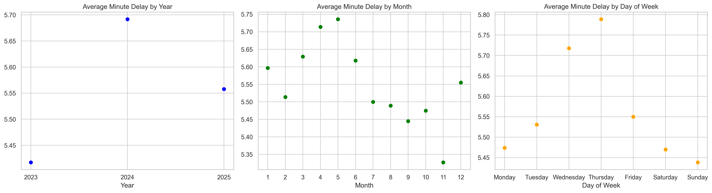
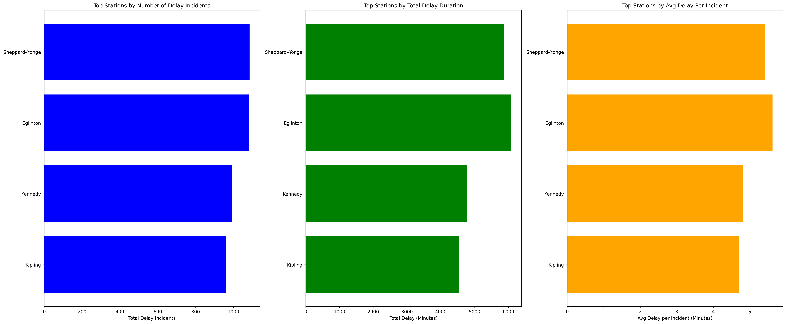

# Predicting Toronto Transit Commission (TTC) Subway Delay Duration
## Cohort 8 - Group 7 ML
### Business Case

People in Toronto rely on the TTC subway for their day-to-day activities, making it a crucial part of the city’s transportation system.

The TTC subway currently faces frequent service disruptions, which negatively impact **operational efficiency**, **passenger satisfaction**, and **system reliability**. The TTC records detailed historical data on subway delay incidents. Currently, this data is primarily used for reporting purposes rather than predictive planning.

This project proposes the development of a **regression-based machine learning model** to predict subway delay duration using historical operational data. By identifying patterns in delay severity across **time**, **station**, and **incident types**, the model aims to:

- Support proactive operational decision-making  
- Improve transit reliability management  

Beyond operational optimization, the predicted delay durations generated by this model can be shared with riders to:

- Improve estimated waiting time accuracy  
- Enhance trip planning reliability  
- Increase passenger satisfaction

### Project Objective

The primary objective of this project is to build and evaluate a machine learning regression model that predicts **delay duration (in minutes)** using the TTC Subway Delay dataset. 

The model will:  
- Forecast the expected delay length based on different features  
- Identify key drivers of severe delays  
- Provide interpretable insights to non-technical users  

## Project Overview

### What value does your project bring to the industry?

This project leverages historical subway delay data to provide insights for the TTC and its riders.  

**Stakeholders:**

- **TTC Operations and Management:**  
  - Predicting delay durations helps allocate staff efficiently, adjust train schedules proactively, and respond to high-risk delays.  
  - Supports infrastructure planning and maintenance priorities based on predictive insights.

- **TTC Riders:**  
  - Benefit from more accurate delay estimates and improved trip planning.  
  - Lays groundwork for future applications providing real-time waiting time predictions.

### How will you answer your business question with your chosen dataset?

We will use the **TTC Subway Delay dataset** from the City of Toronto Open Data Portal, which contains 13 years of historical records (2014-2026) including ~255,000 total delay records, 100-185 unique delay codes per year for multiple subway lines and service directions including a notable dip in records over the 2020-2021 years (likely reflecting pandemic-related service changes). The table below shows the different variables within the dataset and their descriptions. Our goal is to predict the duration of subway delays (Min Delay) to help the TTC improve operational planning and, in the future, provide riders with better waiting time estimates.

### Data Summary
| Column Name | Description |
|-------------|-------------|
| Date        | Date of delay event |
| Time        | Time of delay event |
| Day         | Day of the week |
| Station     | Station where delay occurred |
| Code        | TTC delay code (categorical incident type) |
| Min Delay   | Number of minutes of delay |
| Min Gap     | Service gap in minutes caused by delay |
| Bound       | Direction of travel (e.g., N, S, E, W) |
| Line        | Subway line identifier |
| Vehicle     | Vehicle number associated with delay |

| Year | Number of Records | Unique Lines | Unique Delay Codes |
|------|-------------------|--------------|--------------------|
| 2014 | 20,424            | 11           | 159                |
| 2015 | 21,474            | 17           | 162                |
| 2016 | 21,162            | 16           | 165                |
| 2017 | 18,885            | 20           | 177                |
| 2018 | 20,737            | 15           | 184                |
| 2019 | 19,222            | 23           | 185                |
| 2020 | 14,782            | 22           | 184                |
| 2021 | 16,370            | 17           | 173                |
| 2022 | 19,895            | 21           | 179                |
| 2023 | 22,949            | 14           | 177                |
| 2024 | 26,467            | 22           | 125                |
| 2025 | 25,713            | 18           | 131                |
| 2026*| 2,478             | 8            | 100                |

*2026 appears to be partial-year data.

To answer our business question, we will first explore the dataset to uncover patterns and relationships that may influence delay duration. The dataset will require cleaning and preprocessing to ensure high-quality inputs for modeling:

- **Missing Values:** Records with missing Min Delay, delay codes, or invalid vehicle numbers will be removed during preprocessing.  
- **Outliers:** Extremely long delays will be identified and handled to avoid distorting regression results.  
- **Contextual Features:** While the dataset does not include weather or ridership data, historical weather data from Toronto can be integrated during preprocessing for additional insights.  
- **Historical Limitation:** Since the dataset contains only past records, it cannot simulate real-time predictions.

We will perform feature engineering to enhance predictive power:  
- **Temporal Features:** hour, peak/off-peak, weekday/weekend, month  
- **Spatial Features:** station, line, bound  
- **Incident Features:** delay codes  

Next, we will train machine learning models to predict **Min Delay**:  

- **Linear Regression:** Will serve as a baseline model to understand the relationships between features and delays.  
- **Random Forest Regressor:** Will capture non-linear patterns and interactions between features.  
- **Gradient Boosting (XGBoost):** Will combine multiple weak learners to improve predictive accuracy.

To simulate real-world forecasting, we will use a **time-aware train, validation, and test split**.

Model performance will be evaluated using:  

- **Mean Absolute Error (MAE):** To measure the average difference between predicted and actual delays.  
- **Root Mean Squared Error (RMSE):** To penalize large prediction errors more heavily.

To make the results interpretable, we will apply several techniques:

- **Feature Importance:** To identify which factors most influence delay duration.  
- **Residual Analysis:** To check patterns in prediction errors and ensure model reliability.  
- **SHAP Analysis:** To explain how each feature contributes to predicted delay duration. This will help TTC understand the key drivers of delays and support more informed operational and planning decisions.

### What are the risks and uncertainties?

We recognize several factors that could impact the reliability and performance of our delay prediction model. Subway delay durations are highly variable, and extreme events may occur that are inherently unpredictable. Additionally, the dataset lacks real-time operational context, such as current weather conditions, ridership levels, or ongoing maintenance issues, which could influence delays but are not captured in historical data.  

Some patterns at the station level may also be misleading if interpreted without proper operational context. For example, certain stations might appear to have frequent delays due to reporting biases or unusual incidents, rather than systemic problems. Historical data may not fully represent future operations, meaning the model’s predictions will be most reliable for typical delay scenarios and less so for rare or unprecedented events.  

During modeling, we will also account for data-specific risks. Missing or inconsistent records, extreme outliers, or features that are only available after a delay occurs could distort predictions if not handled carefully. Our goal is to build a model that is not only technically sound but also reliable and interpretable, providing actionable insights for TTC operations and planning while supporting future rider-facing applications.

### What methods and technologies will you use?

We will use **Python** as our primary programming environment, providing a versatile platform for data processing, modeling, and visualization. All work will be tracked in **GitHub** to follow best practices for collaboration and reproducibility.

Our planned workflow includes several key steps:

- **Data Preprocessing:** We will clean the dataset by handling missing values, removing invalid records, and addressing outliers. Features such as temporal (hour, peak/off-peak, weekday/weekend, month), spatial (station, line, bound), and incident codes will be engineered to improve predictive power. This step ensures the data is ready for modeling.  

- **Exploratory Data Analysis (EDA):** We will visualize patterns, correlations, and outliers using tools like **matplotlib** to understand how different features relate to delay duration and to inform feature selection. For data exploration, we plotted the average delay by year, month and day of the week. We also plotted the top station with delays. These plots are shown below. 

- **Modeling:** We will evaluate regression algorithms, including **Linear Regression** (baseline), **Random Forest Regressor**, and **Gradient Boosting (XGBoost)**. These models will help capture both linear and non-linear patterns in the data. 

- **Validation and Tuning:** To simulate real-world forecasting, we will use **time-aware train, validation, and test splits**. Hyperparameter tuning will be conducted using **RandomizedSearchCV**, and **TimeSeriesSplit** cross-validation will help ensure robust performance.  

- **Evaluation:** Models will be evaluated using **Mean Absolute Error (MAE)** and **Root Mean Squared Error (RMSE)** to measure prediction accuracy and penalize large errors.  

- **Model Interpretation:** We will use **feature importance** and **residual analysis** to understand model behavior, and **SHAP values** to explain how each feature contributes to predicted delay durations. This will provide actionable insights for TTC operations and planning.  

The combination of these tools and techniques will allow us to build a reliable, interpretable, and operationally useful machine learning model that predicts subway delays and supports both TTC management and future rider-facing applications.

## Instruction, Modeling and Key Findings

### Setup & Reproduction

To reproduce the results, please follow the setup file to set up the `uv` environment and install all dependencies, then run the two notebooks below.

| Model | Notebook |
|-------|----------|
| Random Forest | [RandomForest.ipynb](model/RandomForest.ipynb) |
| XGBoost | [XGboost.ipynb](model/XGboost.ipynb) |

### 1. Dropping Linear Regression

Linear regression is not well suited for this problem because subway delay patterns are highly nonlinear and complex. The relationship between features such as incident code, station, hour of day, and delay minutes is unlikely to follow a simple linear structure.  
For example, certain incident codes may cause disproportionately large delays, and peak-hour effects may interact with station congestion in nonlinear ways.

### 2. Model Performance (Random Forest vs XGBoost)

| Metric | Random Forest | XGBoost |
|--------|--------------|---------|
| MAE (minutes) | 2.0151 | 1.9871 |
| RMSE (minutes) | 2.6552 | 2.6252 |
| MAPE (%) | 41.61% | 40.76% |
| R² | 0.1066 | 0.1267 |
| Best CV MAE | 2.0560 | 2.0123 |

**XGBoost** outperforms **Random Forest** across all metrics. Both models are practically similar in accuracy.

### 3. Interpretation and Discussion

### Feature Importances

The XGBoost feature importance analysis indicates that operational variables, particularly `code_enc`, are the dominant drivers of subway delay predictions. Temporal features such as `hour`, `peak_hour`, and station-related variables also contribute meaningfully, while broader seasonal indicators like `month` and `is_weekend` have comparatively smaller effects. This suggests that delay severity is influenced more by incident type and immediate operating conditions than by long-term seasonal patterns.

### Residual Distribution

The residual distribution shows that most prediction errors are concentrated within a small range, indicating reasonable performance for typical delay events. However, the distribution is slightly right-skewed, with a long positive tail, suggesting the model tends to underpredict extreme delay cases. This highlights a limitation in capturing rare but high-impact disruptions.

### SHAP Analysis

The SHAP analysis reinforces these findings by providing insight into both the magnitude and direction of feature effects. Incident code, time of day, and station characteristics consistently demonstrate the strongest global influence on predictions. Overall, the model captures key operational drivers of delay but may require further tuning or additional features to better model extreme events.

## Final Conclusion & Future Work

### Does Our Model Work Well?
The model shows promise but has limitations. On the positive side, predictions are off by only about 2 minutes on average, and the model correctly identifies delay code type, hour of day, and station as the strongest predictors — all of which make real-world sense. However, an R² of 0.13 means the model only explains 13% of the variance in delay duration, and a MAPE of 40.76% suggests it still struggles with shorter or more unpredictable delays. Overall, the model provides a useful baseline but is not yet accurate enough for direct passenger-facing deployment.

### Does It Fulfil the Project Goal?
The model partially fulfils the project goals. It demonstrates that delay duration can be predicted from operational features, and the insights around delay codes, stations, and time of day can support proactive decision-making and reliability management. However, the prediction accuracy is not yet sufficient to meaningfully improve estimated waiting times or passenger satisfaction at a deployment level. Further development is needed before the model can be reliably integrated into rider-facing systems.

### Future Work
The most impactful next step is enriching the feature set. While temperature was included in this model, the weather data was not complete — expanding it to cover the full dataset and adding additional weather variables such as snowfall, precipitation, and visibility could significantly improve the model's explanatory power. Historical station-level delay frequency and network congestion signals are also worth exploring. Finally, reframing the problem as a classification task — predicting delay severity bands (minor, moderate, severe) rather than exact minutes — could make the model more actionable for both operators and passengers, and serve as a stronger foundation for real-time integration with TTC data feeds.

## Team Videos

| Video Link |
|---|
| [Hemant Walia](https://tbd) |
| [Kamran Akbari-moornani](https://tbd) |
| [Leo Liu](https://drive.google.com/file/d/1yKPh0lJW5_4A1DEFVBAT4VPn4XIYAqHp/view?usp=sharing) |
| [Nader Mostaghimi](https://tbd) |
| [Safa Ben Othman](https://drive.google.com/file/d/19jYegbaFc3JjhNYt_w4JawVFQkrere6n/view?usp=drive_link) |
